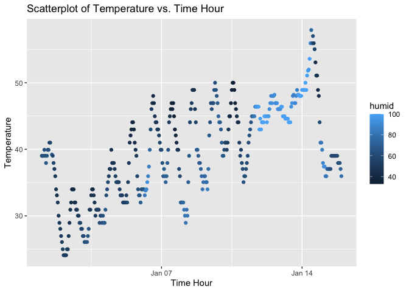

P8105 HW 1
================
Yuki Low (yl5503)
09/15/2023

**Problem 1**

Loading data and the libraries needed for this homework:

``` r
library(moderndive)
library(ggplot2)
library(tidyverse)
data("early_january_weather")
```

``` r
temps <- pull(early_january_weather, temp)
```

There are 15 variables in this dataset named `early_january_weather`.
The only character variable in this dataset is `origin`. The integer
variables are as follows: `year`, `month`, `day`, `hour`. The numerical
variables are as follows: `temp`, `dewp`, `humid`, `wind_dir`,
`wind_speed`, `wind_gust`, `precip`, `pressure`, `visib`. The only
POSIXct variable is `time_hour`. The dataset has 358 rows and 15
columns. The mean temperature is 39.5821229 degrees.

``` r
scatterplot <- ggplot(early_january_weather, mapping = aes(x = time_hour, y = temp, color = humid)) +    geom_point() + 
  labs(x = "Time Hour", y = "Temperature", title = "Scatterplot of Temperature vs. Time Hour")

ggsave("scatterplot.png", plot = scatterplot, width = 8, height = 6)

scatterplot
```

<!-- -->

The scatterplot of `temperature` vs. `time_hour` exhibits a repeating,
cyclic pattern suggesting a daily weather pattern which can indicate
that temperature and time hour follow a predictable trend over the
course of the day. The scatterplot also shows a clear gradient from dark
blue to light blue which can indicate that humidity increases as time
hour increases in the month of January. The scatterplot also has an
overall increasing trend which can indicate that temperature increases
as time hour increases in the month of January.

**Problem 2**

``` r
problem_2_df <- tibble(
  samples = rnorm(10),
  log_vector = c(samples > 0),
  char_vector = c('a','b','c','d','e','f','g','h','i','j'),
  factor_vector = as.factor(c('small', 'medium', 'small', 'medium', 'large', 'large','medium','large','medium','large'))
  
)

samples_mean <- mean(pull(problem_2_df,samples))
log_mean <- mean(pull(problem_2_df,log_vector))
char_mean <- mean(pull(problem_2_df,char_vector))
factor_mean <- mean(pull(problem_2_df,factor_vector))
```

- The mean of the:
  - samples vector is -0.5761062.
  - log_vector is 0.3.
  - char_vector is NA.
  - factor_vector is NA.

You are only able to find the means of the random sample vector and the
logical vector.

``` r
new_log_mean <- mean(as.numeric(pull(problem_2_df,log_vector)))
new_char_mean <- mean(as.numeric(pull(problem_2_df,char_vector)))
new_factor_mean <- mean(as.numeric(pull(problem_2_df,factor_vector)))
```

- The mean of the:
  - new log_vector is 0.3.
  - new char_vector is NA.
  - new factor_vector is 1.8.

The log_vector and factor_vector were converted into numerical vectors.
For the logical vector, `TRUE` and `FALSE` values turned into `0` and
`1` whereas for the factor vector, `small`, `medium`, `large` values
turned into `0`, `1`, `2`. Since the `factor_vector` is now converted
into a numeric vector, we can now find the mean. However, when the
as.numeric function is being applied to the char vector, it does not
know what numeric value to convert each of the chars to. Therefore, each
char does not have a numeric representation and therefore, we are unable
to find the mean even after applying the as.numeric function.
